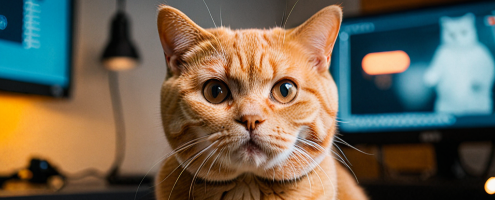

# CatGen - DCGAN model

CatGen is a [DCGAN](https://arxiv.org/abs/1511.06434) trained to mode capable of generating images from custom dataset. I have used over 1000 photos of my British Shorthair cat. Of course such number of data was not enough so the dataset was augmented to over 75 000 images using different data augmentation technics. Due to deficits of computer power the best of three models trained were train for only 15 epochs. All thou I'm planning to tain the model farther in the future the main goals of this project was achieved. 

## Project Goals

**1. Proof that it is possible to train a model on own limited data**
Many of the Machine Learning projects described in courses and literature are trained on preprocessed datasets. This make it easier to focus on trained model and not data processing which can take a lot of time. **Creating this project I was curious what it takes to build a dataset  suitable for model training from scratch.** Without a doubt, preparing the data took a lot of time, while at the same time allowing me to understand the challenges the project has to face when the data has to be prepared from scratch for model training. 

**2. Creation of working prototype**
Although the images generated by the generator model are still easily distinguishable from the real images, even 15 training epochs show that with longer training it is possible to obtain much better quality. 

**3. Better underspending of ML in practice**
